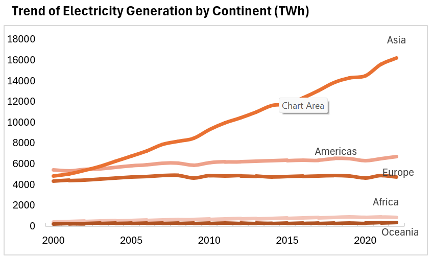
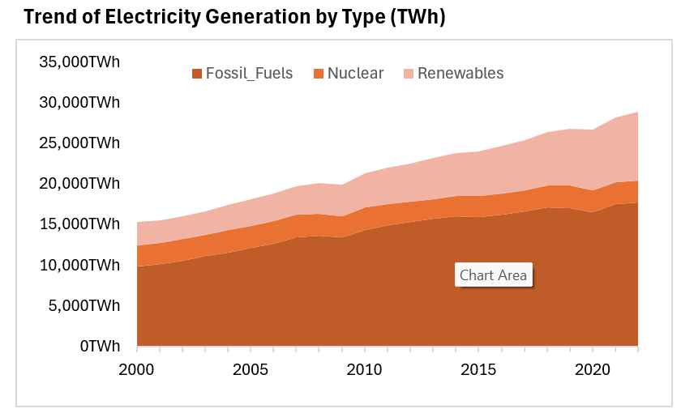
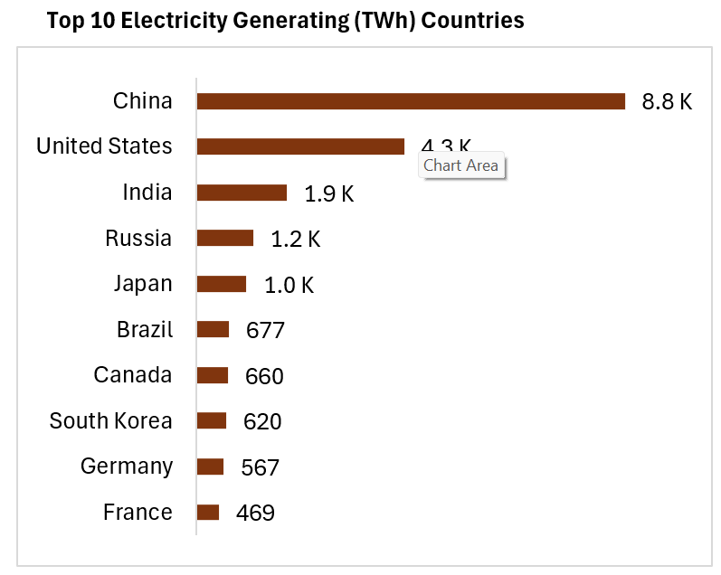
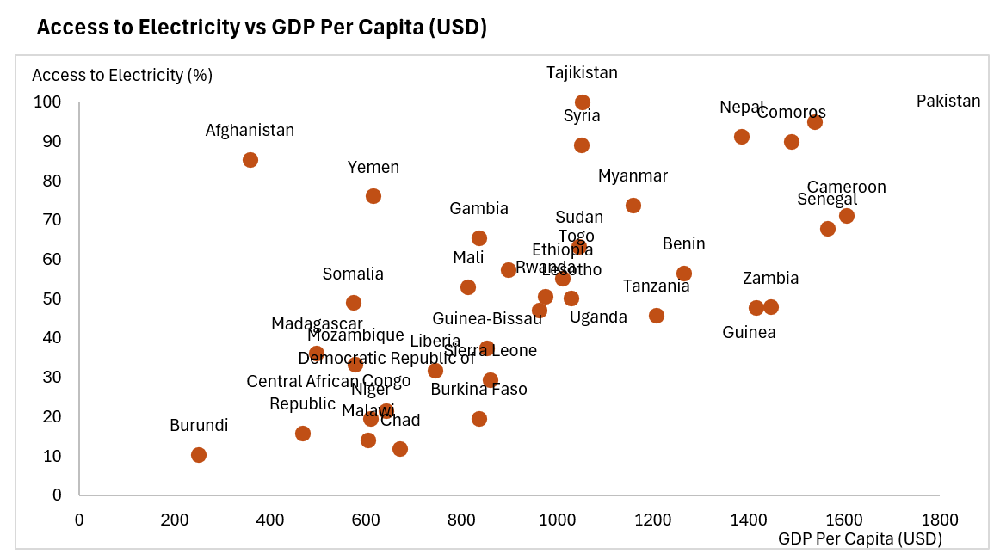

# Global Energy, Electricity Access, and Economic Development Analysis (2000–2022)


# Project Overview

This SQL Server project analyzes global energy production, energy consumption, electricity access, and economic development trends between 2000 and 2022.

The analysis combines multiple international datasets to investigate how electricity generation sources (renewables, nuclear, and fossil fuels) relate to electricity accessibility, GDP per capita, and overall energy consumption across countries and continents.

The project demonstrates practical SQL skills including data cleaning, transformation, joins, aggregation, view creation, and business-oriented analysis.

---

# Problem Statement

Governments and energy organizations need to understand:

* How electricity generation has evolved across continents.
* The relationship between energy production and access to electricity.
* Whether economic prosperity correlates with electricity generation and access.
* The role of renewable, nuclear, and fossil fuel energy sources in meeting global electricity demand.

This project answers these questions using historical energy and economic data from countries worldwide.

---

# Dataset Description

### Database Name

`[TDI]`

### Primary Tables

| Table Name                                         | Description                                 |
| -------------------------------------------------- | ------------------------------------------- |
| elec-fossil-nuclear-renewables                     | Electricity generation by energy source     |
| change-energy-consumption                          | Annual change in primary energy consumption |
| electricity-generation                             | Total electricity generation                |
| primary-energy-cons                                | Primary energy consumption                  |
| share-of-the-population-with-access-to-electricity | Population electricity access rates         |
| GDP-Per-Capita-usd                                 | GDP per capita data                         |
| country_codes_and_continents                       | Country-to-continent mapping                |

### Estimated Dataset Coverage

| Metric        | Value          |
| ------------- | -------------- |
| Countries     | 34 |
| Continents    | 6              |
| Years Covered | 2000–2022      |

---

# Schema / Relationship Diagram

```text
                            country_codes_and_continents
                                      |
                                      |
                                      |
                                      V
+-----------------------------------------------+
| elec-fossil-nuclear-renewables                |
| (Country, Code, Year)                         |
+-----------------------------------------------+
          |            |            |          |
          |            |            |          |
          V            V            V          V

change-    electricity-  primary-    access-
energy-    generation    energy-     electricity
consumption              consumption

          |
          |
          V

      GDPData
```

### Key Relationships

Primary Key:

```sql
(Code, Year)
```

Foreign Keys:

```sql
Code
Year
```

---

# Technical Stack

Database:

* Microsoft SQL Server
* T-SQL

Tools:

* SQL Server Management Studio (SSMS)
* GitHub
* Excel (visualization)


Techniques:

* Dynamic SQL
* UNPIVOT
* CTEs
* Views
* Data Cleaning
* Aggregations
* Joins

---

# Installation & Setup

### Clone Repository

```bash
git clone https://github.com/Me1rem/global-energy-analysis.git
```

### Open SQL Server

Launch SQL Server Management Studio (SSMS)

### Create Database

```sql
CREATE DATABASE TDI;
USE TDI;
```

### Import Data

Import all CSV files into their corresponding SQL tables.

### Execute Scripts

Run scripts in order:

```text
1_Data_Loading.sql
2_Data_Cleaning.sql
3_Data_Transformation.sql
4_EDA.sql
5_Analysis.sql
```

---

# Data Cleaning & Transformation

Key cleaning activities performed:

### Missing Value Handling

```sql
UPDATE [electricity-generation]
SET Electricity_generation_TWh = 0
WHERE Electricity_generation_TWh IS NULL;
```

### GDP Table Transformation

Converted GDP data from Wide Format to Long Format using:

```sql
UNPIVOT
```

and

```sql
Dynamic SQL
```

### Duplicate Removal

```sql
DELETE FROM table_name
WHERE id NOT IN (
    SELECT MIN(id)
    FROM table_name
    GROUP BY Entity, Code, Year
);
```

### Data Type Standardization

```sql
ALTER TABLE
ALTER COLUMN
DECIMAL(18,2)
```

---

# Key Queries & Insights

## Query 1: Average Global Energy Indicators by Year

### Business Question

How have global energy indicators changed over time?

### SQL

```sql
WITH CleanedData AS (
    ...
)

SELECT
    Year,
    AVG(Electricity_from_Renewables),
    AVG(Electricity_from_Nuclear),
    AVG(Electricity_from_Fossil_Fuels)
FROM CleanedData
GROUP BY Year
ORDER BY Year;
```

### Insight

Tracks long-term changes in electricity production patterns globally.

---

## Query 2: Electricity Generation Trend by Continent

### Business Question

Which continents generate the most electricity?

### SQL

```sql
SELECT
    Year,
    Continent,
    SUM(Electricity_generation_TWh)
FROM CleanedTable
GROUP BY Year, Continent;
```

### Expected Output

| Year | Continent | Electricity Generation |
| ---- | --------- | ---------------------- |
| 2022 | Asia      | 14,000+                |
| 2022 | Europe    | 5,000+                 |

### Insight

Asia dominates global electricity generation.

---

## Query 3: Electricity Access vs Energy Sources

### Business Question

Does increased electricity generation improve electricity access?

### SQL

```sql
SELECT
    Country,
    Electricity_from_renewables_TWh,
    Electricity_from_nuclear_TWh,
    Electricity_from_fossil_fuels_TWh,
    Access_to_electricity
FROM CleanedTable;
```

### Insight

Countries with diversified energy portfolios often achieve higher electricity access rates.

---

## Query 4: Global Energy Mix Trend

### Business Question

How has the global energy mix evolved?

### SQL

```sql
SELECT
    Year,
    SUM(Electricity_from_renewables_TWh),
    SUM(Electricity_from_nuclear_TWh),
    SUM(Electricity_from_fossil_fuels_TWh)
FROM CleanedTable
GROUP BY Year
ORDER BY Year;
```

### Insight

Renewable energy generation continues to increase globally.

---

## Query 5: Top 10 Electricity Generators (2022)

### Business Question

Which countries generated the most electricity in 2022?

### SQL

```sql
SELECT TOP 10
    Country,
    Electricity_generation_TWh
FROM CleanedTable
WHERE Year = 2022
ORDER BY Electricity_generation_TWh DESC;
```

### Insight

Identifies global energy leaders.

---

## Query 6: GDP Per Capita vs Electricity Access

### Business Question

Do wealthier countries have greater electricity access?

### SQL

```sql
SELECT
    Country,
    GDP_Per_Capita_USD,
    Electricity_generation_TWh,
    Access_to_electricity
FROM CleanedTable
WHERE Year = 2022;
```

### Insight

Higher GDP per capita generally correlates with higher electricity access.

---

## Query 7: Energy Consumption Impact

### Business Question

How does energy consumption growth affect electricity production?

### SQL

```sql
SELECT
    Country,
    Annual_change_in_primary_energy_consumption,
    Electricity_from_renewables_TWh,
    Electricity_from_nuclear_TWh,
    Electricity_from_fossil_fuels_TWh
FROM CleanedTable;
```

### Insight

Countries with increasing energy demand tend to expand electricity generation capacity.

---

# Reusable View

A consolidated analytical view was created:

```sql
CREATE VIEW CleanedTable AS
SELECT ...
```

Benefits:

* Simplifies reporting
* Improves query readability
* Centralizes business logic

---

# Performance Optimization

### Current Optimizations

Data Cleaning:

```sql
COALESCE()
```

```sql
IS NULL
```

Duplicate Removal:

```sql
IDENTITY
```

Reusable Layer:

```sql
CREATE VIEW
```

### Recommended Indexes

```sql
CREATE INDEX idx_code_year
ON [elec-fossil-nuclear-renewables](Code, Year);
```

```sql
CREATE INDEX idx_country_code
ON country_codes_and_continents(Country_Code);
```

Expected Benefits:

* Faster joins
* Reduced scan operations
* Improved aggregation performance

---

# Results & Business Recommendations

### Findings
### Electricity Generation Trends


- **Electricity Generation Growth**: All continents experienced an increase in electricity generation, with Asia leading due to rapid industrialization in China and India.
- **Electricity Access & Generation**: Countries with higher access to electricity tend to rely more on renewables.


- **Fossil Fuel Dominance**: Despite growth in renewables, fossil fuels remain the dominant source of electricity.
Over the years, there was a gradual increase in the share of electricity generated from renewable sources, with fossil fuels remaining dominant in many countries. Nuclear generation, however, showed little overall growth.

### Top Electricity Generators (2022)


- **Top 10 Electricity Generators (2022)**: China, the US, India, Russia, and Japan.

### GDP Per Capita and Electricity Access

- **GDP and Electricity Access**: A positive correlation exists between higher GDP per capita and increased electricity access from renewables.
Higher GDP per capita was found to be positively correlated with higher access to electricity, especially from renewables, indicating that wealthier nations are investing more in clean energy technologies.

### Recommendations

1. Increase renewable energy investment in low-access regions.
2. Improve energy infrastructure in developing countries.
3. Encourage energy diversification to improve resilience.
4. Use GDP and electricity access indicators together for policy planning.


---

# How to Reproduce

1. Clone repository.
2. Create SQL Server database.
3. Import datasets.
4. Execute cleaning script.
5. Execute transformation script.
6. Create analytical views.
7. Run analysis queries.
8. Compare outputs with screenshots in `/results`.

Expected setup time:

**5–10 minutes**

---

# Future Improvements

* Implement Window Functions:

  * ROW_NUMBER()
  * RANK()
  * LAG()
  * LEAD()

* Create Stored Procedures for recurring reports.

* Add Partitioning for large datasets.

* Build Power BI Dashboard.

* Add Statistical Correlation Analysis.

* Create Materialized Reporting Tables.

---

# Repository Structure

```text
Global-Energy-Analysis/
│
├── datasets/
├── sql/
│   ├── 1_data_cleaning.sql
│   ├── 2_transformation.sql
│   ├── 3_eda.sql
│   ├── 4_analysis.sql
│
├── results/
├── screenshots/
├── README.md
│
└── LICENSE
```

### Challenges & Solutions
I encountered a couple of challenges in the analysis including:
- **Missing Data**: Filled missing values with appropriate defaults.
- **Data Format Issues**: Used dynamic SQL for data transformation.
- **Duplicate Data**: Identified and removed duplicates using primary keys.
- **Complex Joins**: Preprocessed data to ensure seamless merging.

### Data Sources
- [World Bank](https://data.worldbank.org/indicator/NY.GDP.PCAP.CD)
- [Our World in Data - Energy](https://ourworldindata.org/energy-production-consumption)
- [Our World in Data - Electricity Access](https://ourworldindata.org/energy-access)
- [Our World in Data - Energy Problems](https://ourworldindata.org/worlds-energy-problem)

### Author

**ONWUPELU MIRACLE**

Data Analyst | SQL Developer | Business Intelligence Enthusiast

If you found this project helpful, feel free to star the repository.
